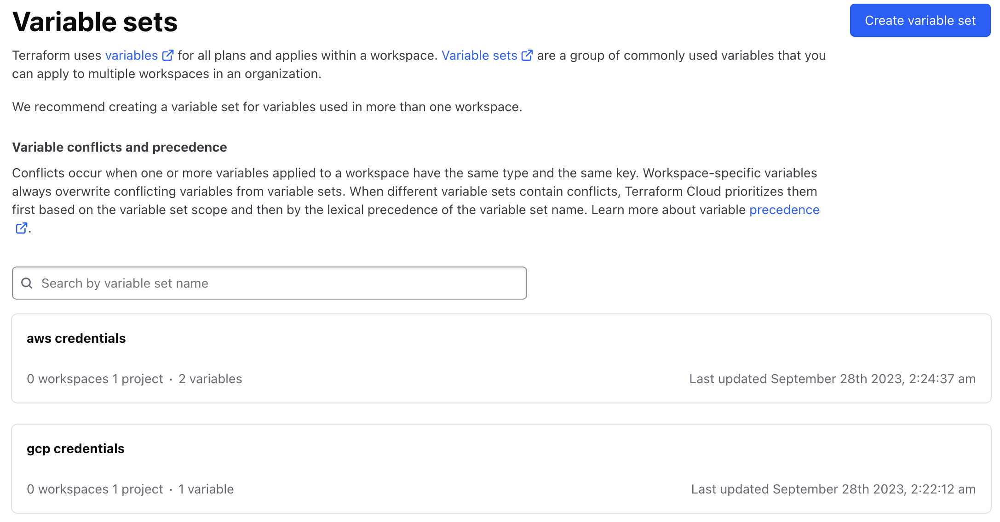
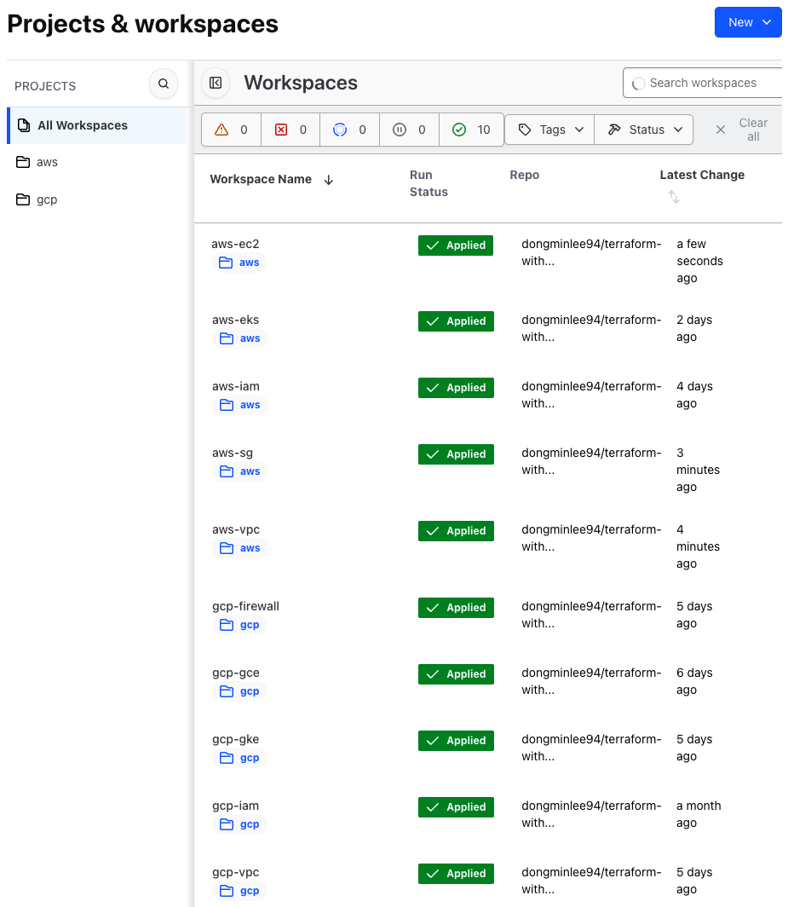

# Terraform with Cloud

[](https://opensource.org/licenses/Apache-2.0)
[](https://github.com/hashicorp/terraform/releases)
[](https://developer.hashicorp.com/terraform/cloud-docs)
[](https://developer.hashicorp.com/terraform/cli/commands/fmt)
[](https://github.com/terraform-linters/tflint)
[](https://github.com/terraform-docs/terraform-docs)

Welcome to the repository designed for hands-on experience with Terraform across cloud platforms such as AWS and GCP.

## Installation

For MacOS users, the required packages from this repository can be installed using the following command:

```bash
$ make init
```

This command initializes your setup by installing the necessary dependencies to manage and deploy infrastructure using Terraform on your local system.

## Preparation

### 1. AWS CLI

The AWS CLI is a command-line tool necessary for managing Amazon Web Services. It is essential for managing AWS resources and setting up credentials.

**Installation**:

To install the AWS CLI, follow the instructions in the [official AWS documentation](https://docs.aws.amazon.com/cli/latest/userguide/getting-started-install.html).

**Credential Configuration**:

1. Log in to the AWS Management Console and navigate to the IAM service.
2. Use an existing service account or create a new one if necessary. Ensure the account has the proper permissions.
3. In the user details page, go to the `Security credentials` tab and select `Create access key`.
4. Save the generated `AWS_ACCESS_KEY_ID` and `AWS_SECRET_ACCESS_KEY` in a secure location.
5. Run `aws configure` in the command line and enter the retrieved Access Key ID and Secret Access Key.
6. Set your default region and output format.

### 2. GCP CLI

The GCP CLI is a command-line tool necessary for managing Google Cloud Platform. This tool is crucial for managing GCP resources and setting up credentials.

**Installation**:

To install the GCP CLI, follow the instructions in the [official Google Cloud documentation](https://cloud.google.com/sdk/docs/install).

**Credential Configuration**:

1. Log in to the Google Cloud Console and navigate to the IAM & Admin section, then select `Service accounts`.
2. Use an existing service account and make sure it has the appropriate roles.
3. In the `Keys` tab, click `Create new key` and choose JSON format to generate the key.
4. Use the generated JSON file as `GOOGLE_CREDENTIALS`.
5. Run `gcloud auth login` in the command line to authenticate, and set your project with `gcloud config set project [YOUR_PROJECT_ID]`.

### 3. Terraform Cloud

Terraform Cloud is a cloud-based infrastructure management service that securely manages state files and facilitates collaboration and automation. It enhances security, collaboration, automation, and audit logging compared to local state file management.

<p align="center"></p>

In Terraform Cloud, you create variable sets using `AWS_ACCESS_KEY_ID` and `AWS_SECRET_ACCESS_KEY` for AWS, and `GOOGLE_CREDENTIALS` for GCP within `Settings - Variable sets`.

<p align="center"></p>

As shown in the image above, create projects and workspaces tailored to each cloud and infrastructure component. For more detailed information on how to use Terraform Cloud, refer to the [official Terraform Cloud documentation](https://developer.hashicorp.com/terraform/cloud-docs).

## Infrastructure

### 1. AWS

**EC2**

TBD

**EKS**

TBD

### 2. GCP

**GCE**

TBD

**GKE**

TBD
