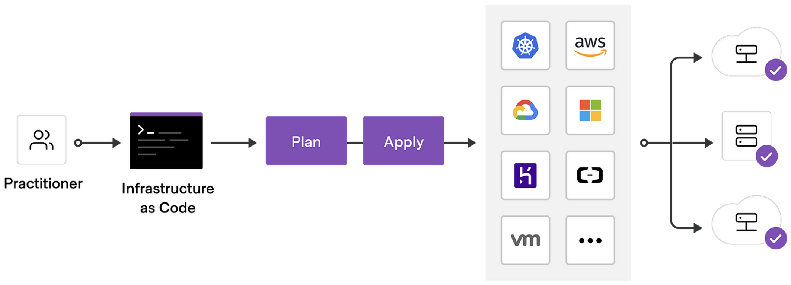

# Terraform with Cloud

[](https://opensource.org/licenses/Apache-2.0)
[](https://github.com/hashicorp/terraform/releases)
[](https://developer.hashicorp.com/terraform/cloud-docs)
[](https://developer.hashicorp.com/terraform/cli/commands/fmt)
[](https://github.com/terraform-linters/tflint)
[](https://github.com/terraform-docs/terraform-docs)

<p align="center"></p>

Welcome to the repository designed for hands-on experience with Terraform across cloud platforms such as AWS and GCP.

## Installation

For MacOS users, the required packages from this repository can be installed using the following command:

```bash
$ make init
```

This command initializes your setup by installing the necessary dependencies to manage and deploy infrastructure using Terraform on your local system.

## Preparation

### 1. AWS CLI

The AWS CLI is a fundamental tool for managing Amazon Web Services, simplifying the control over AWS resources and the setup of access credentials.

**Installation**:

Follow the [AWS documentation](https://docs.aws.amazon.com/cli/latest/userguide/getting-started-install.html) for step-by-step instructions to install the AWS CLI.

**Credential Configuration**:

1. Sign in to the AWS Management Console and go to the IAM service.
2. Select an existing service account or create a new one, verifying it has the correct permissions.
3. Navigate to `Security credentials` in the user details page and choose `Create access key`.
4. Securely store the `AWS_ACCESS_KEY_ID` and `AWS_SECRET_ACCESS_KEY` in a temporary file.
5. Execute the following commands in order.

```bash
# set your credentials, region, and output format
$ aws configure
AWS Access Key ID [None]: <AWS_ACCESS_KEY_ID>
AWS Secret Access Key [None]: <AWS_SECRET_ACCESS_KEY>
Default region name [None]: ap-northeast-1 # Change this to your desired region
Default output format [None]: json
```

### 2. GCP CLI (gcloud)

The GCP CLI is an essential tool for managing Google Cloud Platform, making it easier to handle resources and set up credentials.

**Installation**:

Install the GCP CLI by following the guidelines provided in the [Google Cloud documentation](https://cloud.google.com/sdk/docs/install).

**Credential Configuration**:

1. Access the Google Cloud Console and proceed to the IAM & Admin section to select  `Service accounts`.
2. Confirm that your existing service account has the necessary roles or set up a new one.
3. In the `Keys` tab, hit `Create new key`, opting for the JSON format to generate your key.
4. Securely store the generated key in a temporary file.
5. Execute the following commands in order.

```bash
# authorize gcloud to access the Cloud Platform with Google user credentials
$ gcloud auth login

# set a project property
$ gcloud config set project <YOUR_PROJECT_ID>

# test gcloud command
$ gcloud compute instances list

# create .gcloud directory
$ mkdir -p .gcloud

# copy & paste the stored key
$ vi .gcloud/sa.json

# add environment variables to `.zshrc` or `.bashrc`
$ echo 'export GOOGLE_CLOUD_PROJECT="<YOUR_PROJECT_ID>"' >> ~/.zshrc
$ echo 'export GOOGLE_APPLICATION_CREDENTIALS="$HOME/.gcloud/sa.json"' >> ~/.zshrc
$ source ~/.zshrc
```

### 3. Kubernetes CLI (kubectl)

The Kubernetes CLI, known as `kubectl`, is a powerful tool that lets you deploy and manage applications on Kubernetes. It provides the necessary command-line interface to run commands against Kubernetes clusters.

**Installation**:

You can install `kubectl` on macOS using the following command:

```bash
$ brew install kubectl
```

This will allow you to interact directly with your Kubernetes clusters, managing the deployment, inspection, and debugging of your containerized applications.

## Infrastructure

### 1. AWS

Before you begin setting up your AWS resources, it's important to configure your provider settings to match your desired AWS region. In the `providers.tf` file located within each directory under `src/aws/env`, you'll find the provider configuration. Update the region attribute to your preferred AWS region. For example:

```hcl
provider "aws" {
  region = "ap-northeast-1" # Change this to your desired region
}
```

Set up a range of AWS resources, starting with IAM roles, VPC for networking, and Security Groups (SG). **For security, ensure only your IP can access the resources by setting the `sg_my_ip` variable in your Security Group configuration. You can modify this by referring to the [AWS Security Group configuration](src/aws/env/sg/main.tf#L6).** To obtain your personal IP address, please refer to [whatismyipaddress](https://whatismyipaddress.com/). Once you've set your IP configuration, follow these steps:

```bash
# IAM
$ cd src/aws/env/iam
$ terraform plan
$ terraform apply

# VPC
$ cd src/aws/env/vpc
$ terraform plan
$ terraform apply

# SG
$ cd src/aws/env/sg
$ terraform plan
$ terraform apply
```

**EC2**

The aim is to deploy an EC2 VM instance and establish an SSH connection to it. Your personal public key must be included in the code for access and should be encoded in base64 format for security. Ensure your public key is encoded and then update it at the [file path](src/aws/env/ec2/main.tf#L15).

```bash
$ base64 < ~/.ssh/id_rsa.pub
```

After setting your public key, you're ready to create the EC2 VM instance. Navigate to the EC2 directory and begin the deployment with the following commands:

```bash
$ cd src/aws/env/ec2
$ terraform plan
$ terraform apply
```

After the setup, locate your public IP from the AWS console and connect via SSH with this command:

```bash
$ ssh -i ~/.ssh/id_rsa ec2-user@<public-ip>
```

**EKS**

To begin, you'll create an EKS cluster, which involves setting it up, generating a kubeconfig for access, and then verifying the setup with kubectl commands to ensure everything is functioning correctly. This process allows you to manage and interact with your cluster effectively.

Execute the following commands:

```bash
$ cd src/aws/env/eks
$ terraform plan
$ terraform apply
```

The endpoint for EKS is the creation of an EKS cluster, generating a kubeconfig, and the execution of `kubectl` commands. Configure your EKS cluster and obtain the kubeconfig via:

```bash
$ aws eks update-kubeconfig --region <region-code> --name <cluster-name>
```

Validate your cluster's functionality with the following:

```bash
$ kubectl get node
$ kubectl get pod
$ kubectl get svc
```

### 2. GCP

You must configure your desired region before proceeding with the setup for GCP. Within each `providers.tf` file located under `src/gcp/env`, you'll need to update the provider configuration to reflect your region preferences. Ensure to replace the region value with your actual desired region:

```hcl
provider "google" {
  region  = "asia-northeast1"     # Change this to your desired region
}
```

Adopting the AWS strategy for GCP, start with setting up IAM, and then move on to configuring VPC and Firewall rules. **To ensure your setup is secure, adjust the `firewall_my_ip` variable in your Firewall rules to permit connections only from your personal IP. This can be done by visiting the [GCP Firewall configuration](src/gcp/env/firewall/main.tf#L7).** To obtain your personal IP address, please refer to [whatismyipaddress](https://whatismyipaddress.com/). Once you've set your IP configuration, follow these steps:

```bash
# IAM
$ cd src/gcp/env/iam
$ terraform plan
$ terraform apply

# VPC
$ cd src/gcp/env/vpc
$ terraform plan
$ terraform apply

# Firewall
$ cd src/gcp/env/firewall
$ terraform plan
$ terraform apply
```

**GCE**

Your goal with GCE is to launch a VM instance and establish an SSH connection. Insert your personal public key into the code for access, ensuring it's in base64 format for enhanced security. You can do this at the [file path](src/gcp/env/gce/main.tf#L16), making sure to encode your public key in base64 format before updating.

```bash
$ base64 < ~/.ssh/id_rsa.pub
```

After updating your public key in the code, you're set to launch a VM instance on GCE. Simply head to the GCE directory to start the deployment process:

```bash
$ cd src/gcp/env/gce
$ terraform plan
$ terraform apply
```

Following the instance setup, identify the public IP from the GCP console and proceed to SSH login:

```bash
$ ssh -i ~/.ssh/id_rsa ubuntu@<public-ip>
```

**GKE**

Before proceeding, your task is to set up a GKE cluster, obtain the necessary kubeconfig for access, and then test your connection with kubectl commands to ensure the cluster is properly configured and operational.

Follow these steps with the commands below:

```bash
$ cd src/gcp/env/gke
$ terraform plan
$ terraform apply
```

For GKE, the objective is the establishment of a GKE cluster, followed by kubeconfig acquisition and `kubectl` command testing. Upon GKE cluster creation, pull the kubeconfig using:

```bash
$ gcloud container clusters get-credentials <CLUSTER_NAME> --region <REGION> --project <PROJECT_ID>
```

Ensure everything is running as expected:

```bash
$ kubectl get node
$ kubectl get pod
$ kubectl get svc
```

In each section, replace the placeholders (denoted by angle brackets <>) with your actual configuration details to correctly execute the commands.
